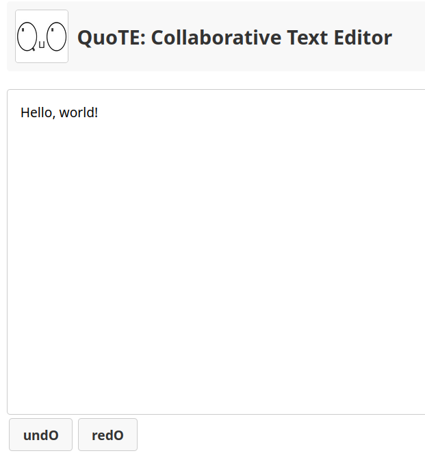

# Collaborative Text Editor - QuoTE (Scala/ZIO)

 <!-- Replace with actual image -->

A real-time collaborative text editor built with Scala (ZIO) and Scala.js, powered by Redis for persistent document storage.

## Key Features

- **Real-time collaboration**: Multiple users can edit the same document simultaneously
- **Conflict-free synchronization**: Operational Transformation ensures consistency
- **Persistent storage**: Redis-backed document history
- **Unified codebase**: Shared Scala logic between backend and frontend via Scala.js
- **Functional core**: ZIO-powered backend with pure functional architecture

## Technology Stack

| Component       | Technology                          |
|----------------|-----------------------------------|
| Backend        | Scala 3 + ZIO 2 + ZIO HTTP         |
| Frontend       | Scala.js + Monadic HTML                 |
| Database       | Redis 7 (persistent document storage) |
| Real-time Sync | WebSockets + Custom OT algorithms  |

### Prerequisites
- JDK 17+
- Docker
- sbt 1.10+

### Installation

1. **QuoTE server (docker)**

    Clone `backend` repository on your host. After this, use  
    `docker load -i quote.tar` inside of `backend` directory, and finally build & up docker containers:  
    `docker-compose build && docker-compose up -d`

2. **QuoTE client (docker)**

    #TODO

